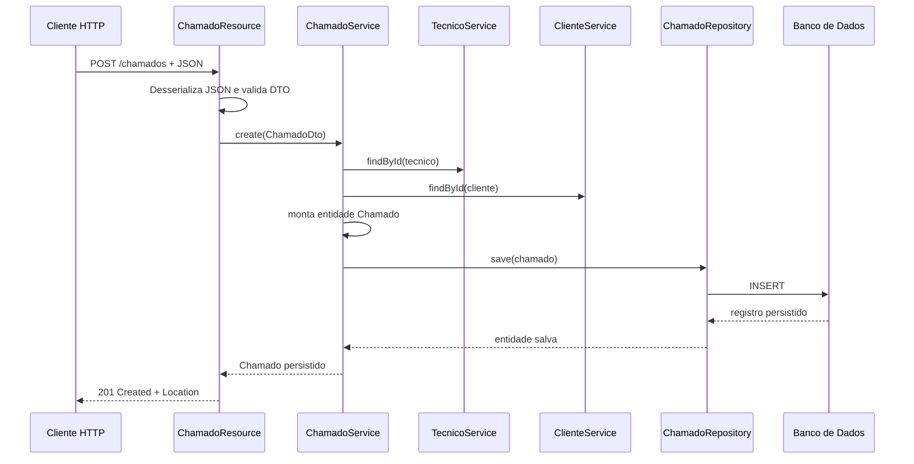

# Documentacao Tecnica do Projeto Helpdesk com Spring Boot

## 1. Visao Geral da Arquitetura

O projeto adota uma arquitetura em camadas, alinhada ao estilo classico de aplicacoes Spring Boot para APIs REST. Na pratica, o sistema esta organizado para separar entrada HTTP, regras de negocio, acesso a dados e representacao do dominio. Essa separacao reduz acoplamento, melhora testabilidade e torna a evolucao mais previsivel.

### Padrao arquitetural utilizado

O desenho atual combina:

- arquitetura em camadas;
- modelo REST para exposicao da API;
- uso de DTOs para trafego de dados na borda da aplicacao;
- persistencia orientada a repositorios com Spring Data JPA;
- tratamento centralizado de excecoes.

### Papel de cada camada

#### Controller

Recebe a requisicao HTTP, faz o binding dos parametros e do corpo JSON, dispara validacoes com `@Valid`, delega a execucao para a camada de servico e monta a resposta HTTP.

Essa camada nao deve concentrar regra de negocio. O papel dela e orquestracao da conversa HTTP.

#### Service

Concentra a logica da aplicacao. E nessa camada que o projeto:

- busca entidades relacionadas;
- aplica validacoes de integridade de negocio;
- decide quando criar, atualizar ou impedir exclusoes;
- converte dados de entrada em objetos de dominio consistentes.

#### Repository

Representa a camada de persistencia. Os repositrios abstraem SQL, transacoes basicas e operacoes CRUD atraves do Spring Data JPA.

#### Model

Contem as entidades do dominio. Aqui estao os objetos que representam conceitos centrais do sistema, como `Pessoa`, `Tecnico`, `Cliente` e `Chamado`.

#### DTO

Os DTOs controlam o contrato exposto pela API. Em vez de serializar diretamente toda entidade JPA, o projeto usa DTOs para:

- expor apenas os campos necessarios;
- evitar vazamento acidental de detalhes internos;
- aplicar validacoes de entrada na borda da API;
- enriquecer a resposta com campos calculados para consumo do cliente, como `nomeTecnico` e `nomeCliente` em `ChamadoDto`.

#### Exception Handler

Centraliza o tratamento de erros, padronizando o payload de resposta quando ocorre excecao de recurso nao encontrado, violacao de integridade ou erro de validacao.

### Por que essa arquitetura faz sentido para o projeto

Para um sistema de helpdesk, o dominio tende a crescer com regras progressivas: estados do chamado, perfis de usuario, regras de atribuicao, historico, SLA, autenticacao e auditoria. Uma arquitetura em camadas e adequada porque mantem o crescimento disciplinado. O controller permanece fino, o service evolui com as regras, e o repository continua focado em persistencia.

---

## 2. Estrutura do Projeto

### Organizacao de pacotes

```text
com.ojuara.helpdesk
|- config
|- controller
|- enums
|- model
|  |- dto
|- repositories
|- services
|  |- exceptions
```

### Responsabilidade de cada pacote

#### `config`

Contem configuracoes de infraestrutura e bootstrap.

- `DevConfig`: popula a base em ambiente de desenvolvimento quando `ddl-auto=create`.
- `SecurityConfig`: define a cadeia de filtros de seguranca via `SecurityFilterChain`.
- `TestConfig`: reservado para comportamento especifico de ambiente de teste.

#### `controller`

Contem os endpoints REST. As classes `ChamadoResource`, `ClienteResource` e `TecnicoResource` representam a porta de entrada HTTP da aplicacao.

#### `enums`

Centraliza valores de dominio fixos, como status, prioridade e perfis. Isso evita strings soltas e melhora legibilidade semantica.

#### `model`

Armazena as entidades de dominio JPA. O pacote modela o estado persistido do sistema.

#### `model.dto`

Contem os objetos de transferencia usados para entrada e saida da API.

#### `repositories`

Contem interfaces de persistencia baseadas em `JpaRepository`.

#### `services`

Implementa os casos de uso do sistema. Essa camada encapsula regra de negocio, orquestra entidades e aciona os repositrios.

#### `services.exceptions`

Define excecoes de negocio e classes auxiliares de resposta de erro.

### Leitura arquitetural da estrutura

O projeto esta organizado por responsabilidade tecnica, nao por tela nem por caso de uso. Esse modelo e simples e funciona bem para sistemas pequenos e medios. Em fases mais avancadas, caso o dominio cresca muito, poderia evoluir para um modelo por modulo funcional, mas o desenho atual ainda e coerente e de facil navegacao.

---

## 3. Camada de Controller

### Papel do `@RestController`

As classes de controller sao o ponto de contato entre cliente e aplicacao. Elas recebem JSON, resolvem parametros de rota, invocam a camada de servico e retornam `ResponseEntity` com status HTTP apropriado.

Exemplo real do projeto:

```java
@RestController
@RequestMapping(value = "/clientes")
public class ClienteResource {

	@Autowired
	private ClienteService service;

	@GetMapping(value = "/{id}")
	public ResponseEntity<ClienteDto> findById(@PathVariable Integer id) {
		Cliente obj = service.findById(id);
		return ResponseEntity.ok().body(new ClienteDto(obj));
	}
}
```

### Mapeamento de endpoints

O projeto usa as anotacoes REST padrao do Spring MVC:

- `@RequestMapping` para definir o caminho base do recurso;
- `@GetMapping` para consultas;
- `@PostMapping` para criacao;
- `@PutMapping` para atualizacao;
- `@DeleteMapping` para remocao.

### Endpoints implementados

#### Tecnicos

- `GET /tecnicos/{id}`
- `GET /tecnicos`
- `POST /tecnicos`
- `PUT /tecnicos/{id}`
- `DELETE /tecnicos/{id}`

#### Clientes

- `GET /clientes/{id}`
- `GET /clientes`
- `POST /clientes`
- `PUT /clientes/{id}`
- `DELETE /clientes/{id}`

#### Chamados

- `GET /chamados/{id}`
- `GET /chamados`
- `POST /chamados`
- `PUT /chamados/{id}`

### Decisoes tecnicas observadas

#### Uso de `ResponseEntity`

O projeto retorna `ResponseEntity`, o que permite explicitar o status HTTP e adicionar cabecalhos quando necessario. Isso e melhor do que retornar diretamente o objeto quando se deseja controle mais fino da resposta.

#### Uso de DTO no contrato

Os controllers evitam expor a entidade JPA diretamente. Isso e uma decisao correta porque desacopla o contrato da API da modelagem persistente.

#### Validacao com `@Valid`

Nos metodos `create` e `update`, os DTOs recebidos sao validados antes da logica de negocio rodar. Isso antecipa erros para a borda da aplicacao.

Exemplo:

```java
@PostMapping
public ResponseEntity<ClienteDto> create(@Valid @RequestBody ClienteDto clienteDto) {
	Cliente newObj = service.create(clienteDto);
	URI uri = ServletUriComponentsBuilder
		.fromCurrentRequest()
		.path("/{id}")
		.buildAndExpand(newObj.getId())
		.toUri();

	return ResponseEntity.created(uri).build();
}
```

### Boas praticas aplicadas

- Controllers finos, delegando regra para services.
- Uso correto dos verbos HTTP.
- Retorno de `201 Created` em criacoes com cabecalho `Location`.
- Validacao automatica na entrada.
- Conversao explicita de entidade para DTO na saida.

### Ponto de atencao

Em `ChamadoResource#create`, o URI e montado com `fromCurrentContextPath()`. Para padronizacao com os outros controllers, `fromCurrentRequest()` costuma ser a opcao mais consistente, pois considera diretamente o endpoint corrente.

---

## 4. Camada de Servico (Service)

### Responsabilidade da camada de negocio

Essa camada representa o centro da aplicacao. O objetivo dela nao e apenas chamar repository, mas garantir que a operacao aconteca obedecendo as regras do dominio.

Exemplo do projeto em `ChamadoService`:

```java
public Chamado create(ChamadoDto objDto) {
	Chamado obj = newChamado(objDto);
	return repository.save(obj);
}

private Chamado newChamado(ChamadoDto objDto) {
	Tecnico tecnico = tecnicoService.findById(objDto.getTecnico());
	Cliente cliente = clienteService.findById(objDto.getCliente());

	Chamado chamado = new Chamado();
	if (objDto.getId() != null) {
		chamado.setId(objDto.getId());
	}

	if (objDto.getStatus().equals(2)) {
		chamado.setDataFechamento(LocalDate.now());
	}

	chamado.setTecnico(tecnico);
	chamado.setCliente(cliente);
	chamado.setPrioridade(PrioridadeEnum.toEnum(objDto.getPrioridade()));
	chamado.setStatus(StatusEnum.toEnum(objDto.getStatus()));
	chamado.setTitulo(objDto.getTitulo());
	chamado.setObservacoes(objDto.getObservacoes());

	return chamado;
}
```

### O que essa camada resolve no projeto atual

- garante busca segura por ID;
- converte DTO em entidade valida;
- impede duplicidade de CPF e email;
- impede exclusao de tecnico ou cliente com chamados vinculados;
- decide quando preencher `dataFechamento` com base no status;
- encapsula excecoes de negocio com semantica mais clara.

### Uso de `@Service`

`@Service` marca a classe como componente gerenciado pelo Spring e expressa intencao semantica: trata-se de logica de negocio, nao apenas infraestrutura.

### Separacao de responsabilidades

O service conversa com repositories e outros services, mas o controller nao conhece detalhes do banco. Isso reduz acoplamento horizontal.

#### Exemplo importante: validacao de unicidade

Em `ClienteService` e `TecnicoService`, a validacao de CPF e email esta centralizada em metodo proprio:

```java
private void validaCpfEmail(ClienteDto clienteDto) {
	Optional<Pessoa> obj = pessoaRepository.findByCpf(clienteDto.getCpf());

	if (obj.isPresent() && obj.get().getId() != clienteDto.getId()) {
		throw new DataIntegrityViolationException("CPF ja cadastrado no sistema");
	}

	obj = pessoaRepository.findByEmail(clienteDto.getEmail());
	if (obj.isPresent() && obj.get().getId() != clienteDto.getId()) {
		throw new DataIntegrityViolationException("Email ja cadastrado no sistema");
	}
}
```

Essa decisao e correta porque a regra e de negocio. O controller nao deveria saber como validar unicidade, e o repository tambem nao deveria conter regra que mistura consulta com decisao funcional.

### Observacao arquitetural importante

Os services atuais estao enxutos e adequados ao escopo. Em sistemas maiores, e comum introduzir:

- metodos transacionais explicitos com `@Transactional`;
- mapeadores dedicados entre DTO e entidade;
- separacao entre comandos de escrita e consultas complexas.

---

## 4.1 Tratamento de Excecoes e Respostas de Erro

### Visao geral da estrategia adotada

O projeto implementa um tratamento centralizado de excecoes na classe `ResourceExceptionHandler`. Em vez de cada controller usar `try/catch`, a API delega ao Spring a captura da excecao e a traducao para uma resposta HTTP padronizada.

Na pratica, o fluxo segue esta ideia:

- o controller recebe a requisicao;
- o Spring faz binding do JSON para o DTO;
- `@Valid` dispara as validacoes declarativas;
- o service executa a regra de negocio e pode lancar excecoes customizadas;
- `@ControllerAdvice` intercepta essas excecoes;
- `@ExceptionHandler` escolhe o metodo adequado para montar o payload de erro.

Essa abordagem e importante porque separa responsabilidades com nitidez: a regra continua no service, o transporte HTTP continua no controller e a padronizacao de erro fica concentrada em um unico ponto transversal.

### Classes envolvidas no projeto

O pacote `services.exceptions` contem as pecas centrais do mecanismo:

- `ObjectNotFoundException`: usada quando o recurso solicitado nao existe;
- `DataIntegrityViolationException`: usada para violacoes de regra de negocio ligadas a integridade funcional, como CPF ou email duplicados e exclusao de registro com chamados vinculados;
- `StandardError`: DTO base das respostas de erro;
- `ValidationError`: especializacao de `StandardError` com lista de erros por campo;
- `FieldMessage`: representa cada erro individual de validacao;
- `ResourceExceptionHandler`: ponto central de traducao entre excecao Java e resposta HTTP.

### Estrutura base do payload de erro

As respostas de erro padrao usam a classe `StandardError`, com os seguintes campos:

- `timestamp`: instante em milissegundos em que o erro foi montado;
- `status`: codigo HTTP numerico;
- `error`: rotulo resumido do tipo de erro;
- `message`: descricao funcional do problema;
- `path`: URI que originou a falha.

Exemplo realista de payload retornado para recurso nao encontrado:

```json
{
	"timestamp": 1713030000000,
	"status": 404,
	"error": "object not found",
	"message": "Objecto nao encontrado Id:99",
	"path": "/clientes/99"
}
```

Essa estrutura e simples, mas suficiente para que front-end, consumidor externo ou ferramenta de teste identifiquem rapidamente:

- o tipo tecnico da falha;
- a mensagem de negocio relevante;
- o endpoint que falhou;
- o status HTTP associado.

### Erro de validacao com detalhes por campo

Quando a falha nasce da validacao do DTO, o projeto usa `ValidationError`, que herda todos os campos de `StandardError` e adiciona a lista `errors`.

Cada item dessa lista e um `FieldMessage`, com:

- `fieldName`: nome do atributo invalido;
- `message`: mensagem especifica da regra violada.

Exemplo coerente com a implementacao atual:

```json
{
	"timestamp": 1713030000000,
	"status": 400,
	"error": "Validation Error",
	"message": "Erro na validacao dos campos",
	"path": "/clientes",
	"errors": [
		{
			"fieldName": "nome",
			"message": "O campo nome e obrigatorio"
		},
		{
			"fieldName": "email",
			"message": "O campo email nao pode conter espacos em branco"
		}
	]
}
```

Esse formato e superior a uma mensagem generica unica porque preserva granularidade. O cliente da API consegue identificar exatamente quais campos precisam ser corrigidos sem tentar inferir isso a partir de texto livre.

### Onde as excecoes nascem no projeto

As excecoes documentadas nao sao abstratas; elas saem diretamente da camada de servico.

#### `ObjectNotFoundException`

E lancada quando uma busca obrigatoria falha. Isso ocorre em metodos como:

- `ClienteService#findById`;
- `TecnicoService#findById`;
- `ChamadoService#findById`;
- `findAll` de cada service quando a lista vem vazia.

Exemplo conceitual do projeto:

```java
return obj.orElseThrow(() -> new ObjectNotFoundException("Objecto nao encontrado Id:" + id));
```

Do ponto de vista HTTP, o `ResourceExceptionHandler` traduz isso para `404 Not Found`.

#### `DataIntegrityViolationException`

Apesar do nome coincidir com uma excecao conhecida do ecossistema Spring, aqui o projeto usa uma excecao customizada propria para representar violacao de regra funcional.

Ela e usada, por exemplo, quando:

- CPF ja existe para outra pessoa;
- email ja existe para outra pessoa;
- tenta-se remover cliente com chamados vinculados;
- tenta-se remover tecnico com chamados vinculados.

Nesses cenarios, o handler devolve `400 Bad Request`, com mensagens como:

- `CPF ja cadastrado no sistema`;
- `Email ja cadastrado no sistema`;
- `Cliente possui ordem de servico, operacao cancelada`;
- `Tecnico possui ordem de servico, operacao cancelada`.

Essa escolha faz sentido porque o erro nao e um problema de sintaxe HTTP nem uma falha interna do servidor; e uma tentativa de operacao invalida segundo as regras do dominio.

### Como o Spring encapsula esse comportamento com annotations

Esse ponto e importante para entender por que o codigo do projeto pode permanecer limpo mesmo com varias regras de erro.

#### `@Valid`

Quando um metodo de controller recebe `@Valid @RequestBody ClienteDto`, o Spring executa a sequencia abaixo antes mesmo de entrar no corpo do metodo:

1. desserializa o JSON para o DTO;
2. aplica as constraints Bean Validation, como `@NotNull` e `@NotBlank`;
3. se houver falha, interrompe a chamada e lanca `MethodArgumentNotValidException`.

Isso significa que o controller nao precisa testar manualmente cada campo. A annotation encapsula o disparo da validacao e o Spring encapsula o resultado em uma excecao padrao do framework.

#### `@RequestBody`

`@RequestBody` instrui o Spring MVC a converter o corpo HTTP em objeto Java usando os `HttpMessageConverters`, normalmente apoiados no Jackson. Esse binding acontece antes da logica de negocio e faz parte do pipeline do framework.

Em conjunto com `@Valid`, o resultado e poderoso: o JSON e convertido e validado de forma automatica, sem boilerplate no controller.

#### `@ControllerAdvice`

`@ControllerAdvice` registra uma classe global de suporte aos controllers. O Spring passa a consultar essa classe sempre que uma excecao escapa do fluxo normal de um endpoint.

Em outras palavras, a annotation encapsula um comportamento transversal: qualquer controller da aplicacao pode lancar uma excecao conhecida e o tratamento sera centralizado, consistente e reutilizavel.

#### `@ExceptionHandler`

Dentro do advice global, cada metodo anotado com `@ExceptionHandler` declara explicitamente qual tipo de excecao sabe traduzir.

No projeto:

- `ObjectNotFoundException` e convertida em `404` com `StandardError`;
- `DataIntegrityViolationException` e convertida em `400` com `StandardError`;
- `MethodArgumentNotValidException` e convertida em `400` com `ValidationError`.

O comportamento importante aqui e que o Spring faz o roteamento da excecao para o handler correto com base no tipo da excecao lancada. O controller nao chama manualmente nenhum desses metodos.

### Papel do `HttpServletRequest` no handler

Os metodos do `ResourceExceptionHandler` recebem `HttpServletRequest` como parametro para extrair a URI original via `request.getRequestURI()`.

Esse detalhe explica de onde sai o campo `path` no payload de erro. O Spring injeta esse objeto no metodo do handler porque ele faz parte do contexto da requisicao atual.

### Diferenca entre erro de validacao e erro de negocio

O projeto ja separa bem duas categorias que costumam se misturar em APIs menores:

- erro de validacao estrutural: campos obrigatorios ausentes, nulos ou em branco;
- erro de negocio/integridade: duplicidade de CPF/email, tentativa de excluir registro vinculado, referencia inexistente.

Essa distincao melhora o contrato da API porque evita respostas ambiguas. Mesmo quando ambos retornam `400` em certos casos, o corpo da resposta deixa claro se o problema e do formato de entrada ou da regra de dominio.

### Fluxo real de erro no projeto

Considere `POST /clientes` com email vazio:

1. o request entra em `ClienteResource#create`;
2. o Spring converte o JSON em `ClienteDto` por causa de `@RequestBody`;
3. `@Valid` executa `@NotNull` e `@NotBlank`;
4. a validacao falha antes de `service.create(...)` ser chamado;
5. o Spring lanca `MethodArgumentNotValidException`;
6. `ResourceExceptionHandler` intercepta a excecao;
7. o handler monta `ValidationError`;
8. a API responde `400 Bad Request` com lista de campos invalidos.

Agora considere `DELETE /clientes/1` para um cliente que possui chamados:

1. o controller chama `service.delete(id)`;
2. o service busca o cliente;
3. a regra detecta chamados vinculados;
4. o service lanca `DataIntegrityViolationException`;
5. o advice global intercepta a excecao;
6. a API responde `400 Bad Request` com `StandardError`.

### Beneficios praticos do desenho atual

O tratamento atual entrega vantagens importantes:

- controllers permanecem limpos e sem `try/catch` repetitivo;
- a API responde com estrutura previsivel;
- o front-end consegue tratar erros de forma programatica;
- novas excecoes podem ser adicionadas sem alterar todos os endpoints;
- a semantica HTTP fica mais clara para o consumidor.

### Limites e observacoes tecnicas

Embora a estrategia esteja correta, alguns detalhes merecem leitura cuidadosa para documentacao fiel ao codigo:

- a excecao `DataIntegrityViolationException` do projeto e customizada, nao e a mesma classe padrao de persistencia do Spring;
- `findAll` lancando `ObjectNotFoundException` para lista vazia e uma decisao de negocio do projeto, nao um comportamento padrao do Spring Data;
- o projeto ainda nao trata explicitamente outros erros do pipeline MVC, como JSON malformado, o que significa que nem todo erro HTTP passa hoje pelo mesmo payload customizado.

Esses pontos sao relevantes porque ajudam a separar o que e comportamento do framework do que e escolha arquitetural especifica da aplicacao.

---

## 5. Camada de Persistencia (Repository)

### Uso do Spring Data JPA

O projeto usa Spring Data JPA para reduzir codigo repetitivo de DAO. Em vez de implementar manualmente operacoes como buscar por ID, listar todos ou salvar, basta declarar interfaces que estendem `JpaRepository`.

Exemplo:

```java
public interface ChamadoRepository extends JpaRepository<Chamado, Integer> {
}
```

### O que `JpaRepository` entrega automaticamente

- `findById`;
- `findAll`;
- `save`;
- `delete`;
- paginacao e ordenacao quando necessario;
- integracao com o contexto de persistencia do JPA.

### Abstracao do acesso a dados

O repository desacopla a regra de negocio da tecnologia especifica de persistencia. O service nao precisa saber se a busca e feita com SQL gerado, Criteria, JDBC ou outro mecanismo. Ele apenas depende do contrato da interface.

### Repositorios existentes no projeto

- `ChamadoRepository`
- `ClienteRepository`
- `TecnicoRepository`
- `PessoaRepository`

### Repositorio com consulta derivada

`PessoaRepository` usa metodos derivados por convencao de nome:

```java
public interface PessoaRepository extends JpaRepository<Pessoa, Integer> {
	Optional<Pessoa> findByCpf(String cpf);
	Optional<Pessoa> findByEmail(String email);
}
```

O Spring Data interpreta esses nomes e gera a consulta automaticamente. Conceitualmente, isso funciona porque, na inicializacao da aplicacao, o framework inspeciona a interface e cria um proxy dinamico que delega as chamadas para a implementacao JPA correspondente.

### Por que essa abordagem e adequada

Para CRUDs e consultas simples, `JpaRepository` oferece excelente custo-beneficio. Reduz volume de codigo, padroniza acesso a dados e deixa o time focado nas regras de negocio.

---

## 6. Entidades (Model)

### Uso de `@Entity`, `@Id` e `@GeneratedValue`

As entidades representam o estado persistente do dominio e sao gerenciadas pelo JPA/Hibernate.

Exemplo de `Chamado`:

```java
@Entity
public class Chamado implements Serializable {

	@Id
	@GeneratedValue(strategy = GenerationType.IDENTITY)
	private Integer id;

	@JsonFormat(pattern = "dd/MM/yyyy")
	private LocalDate dataAbertura = LocalDate.now();

	@ManyToOne
	@JoinColumn(name = "tecnico_id")
	private Tecnico tecnico;

	@ManyToOne
	@JoinColumn(name = "cliente_id")
	private Cliente cliente;
}
```

### Modelagem principal do dominio

#### `Pessoa`

E uma entidade abstrata que concentra atributos comuns a tecnicos e clientes:

- `id`
- `nome`
- `cpf`
- `email`
- `senha`
- `perfis`
- `dataCriacao`

Essa modelagem evita duplicacao e formaliza heranca no dominio.

#### `Tecnico` e `Cliente`

Especializam `Pessoa` e mantem relacionamento com `Chamado` via `@OneToMany`.

#### `Chamado`

Representa a ordem de servico propriamente dita, com prioridade, status, titulo, observacoes e associacoes com tecnico e cliente.

### Mapeamento objeto-relacional (ORM)

O ORM faz a ponte entre objetos Java e tabelas relacionais.

#### Exemplos do projeto

- `@ManyToOne` em `Chamado` para vincular um tecnico e um cliente;
- `@OneToMany(mappedBy = "cliente")` em `Cliente`;
- `@OneToMany(mappedBy = "tecnico")` em `Tecnico`;
- `@ElementCollection(fetch = FetchType.EAGER)` em `Pessoa` para armazenar perfis.

### Por que usar DTO junto com entidade

Entidade e modelo de persistencia. DTO e modelo de contrato. Misturar os dois costuma funcionar no inicio, mas tende a gerar problemas de acoplamento, serializacao, exposicao de campos sensiveis e regressao de API quando o banco evolui. O projeto tomou a decisao correta ao separar essas responsabilidades.

### Observacoes importantes sobre o dominio

#### Perfis como `Set<Integer>`

O projeto armazena internamente os perfis como codigos inteiros e expõe/enxerga semanticamente `PerfilEnum`. Essa estrategia oferece compatibilidade simples com persistencia e mantem boa expressividade no dominio.

#### `@JsonIgnore` em colecoes de chamados

Em `Cliente` e `Tecnico`, o uso de `@JsonIgnore` evita serializacao ciclica e estouro de grafo durante a conversao para JSON.

---

## 7. Explicacao das Principais Anotacoes do Spring

Esta secao explica o papel das anotacoes mais relevantes do projeto nao apenas no uso superficial, mas no modelo mental correto para entender Spring e Spring Boot.

### `@RestController`

#### O que faz

Marca uma classe como controlador REST. Combina o comportamento de `@Controller` com `@ResponseBody` em todos os metodos.

#### Como funciona internamente

Durante o startup, o Spring escaneia classes anotadas como componentes. Ao encontrar `@RestController`, registra a classe no contexto e o Spring MVC mapeia seus metodos como manipuladores de requisicao. O retorno do metodo e escrito diretamente no corpo HTTP via `HttpMessageConverter`, normalmente serializado em JSON com Jackson.

#### Quando usar

Quando a classe expoe endpoints de API e a resposta deve ser serializada diretamente no corpo da resposta.

### `@Service`

#### O que faz

Marca uma classe de regra de negocio como bean gerenciado pelo container Spring.

#### Como funciona internamente

Ela participa do component scan. O Spring cria uma instancia gerenciada da classe e a disponibiliza para injecao de dependencia. Em nivel conceitual, `@Service` nao muda sozinho o comportamento como uma anotacao transacional mudaria, mas melhora semantica, organizacao e integracao com a infraestrutura do framework.

#### Quando usar

Quando a classe implementa caso de uso, regra de negocio, orquestracao de entidades ou validacoes funcionais.

### `@Repository`

#### O que faz

Marca componentes de acesso a dados. No projeto atual, como os repositorios estendem `JpaRepository`, o Spring Data cria as implementacoes automaticamente mesmo sem anotacao explicita na interface.

#### Como funciona internamente

O Spring detecta a interface repository, cria um proxy em runtime e delega operacoes ao mecanismo JPA/Hibernate. Em implementacoes concretas, `@Repository` tambem ajuda na traducao de excecoes de persistencia para a hierarquia de excecoes do Spring.

#### Quando usar

Em classes concretas de acesso a dados ou quando se quer semantica explicita. Em interfaces que estendem `JpaRepository`, a infraestrutura do Spring Data geralmente ja resolve.

### `@Autowired`

#### O que faz

Solicita injecao automatica de dependencia.

#### Como funciona internamente

Quando o Spring cria um bean, ele resolve dependencias procurando objetos compativeis no ApplicationContext. No caso do projeto, por exemplo, `ChamadoResource` recebe automaticamente uma instancia de `ChamadoService`.

#### Quando usar

Quando a classe depende de outro bean gerenciado. Em projetos modernos, injecao por construtor costuma ser preferivel a injecao em atributo por facilitar testes e imutabilidade, mas o uso atual continua funcional.

### `@Bean`

#### O que faz

Registra no contexto Spring o objeto retornado por um metodo de configuracao.

#### Como funciona internamente

O metodo anotado e processado por uma classe `@Configuration`. O valor retornado passa a ser tratado como bean do container.

#### Quando usar

Quando a instancia precisa ser criada manualmente, especialmente para objetos de bibliotecas externas ou configuracoes de infraestrutura.

Exemplo do projeto:

```java
@Bean
public SecurityFilterChain securityFilterChain(HttpSecurity http) throws Exception {
	http
		.csrf(csrf -> csrf.disable())
		.authorizeHttpRequests(auth -> auth
			.requestMatchers("/api/**").permitAll()
			.anyRequest().authenticated()
		);
	return http.build();
}
```

### `@Entity`

#### O que faz

Indica que a classe representa uma entidade persistente do JPA.

#### Como funciona internamente

O provedor JPA mapeia a classe para uma tabela e passa a gerenciar seu ciclo de vida dentro do contexto de persistencia.

#### Quando usar

Quando o objeto representa dado de dominio que precisa ser persistido.

### `@Id`

#### O que faz

Define o identificador primario da entidade.

#### Como funciona internamente

O JPA usa esse campo para distinguir identidade de objeto persistente, sincronizacao com o banco e operacoes como merge, update e delete.

#### Quando usar

Em toda entidade persistente, no atributo que representa a chave primaria.

### `@GeneratedValue`

#### O que faz

Define como a chave primaria sera gerada.

#### Como funciona internamente

Com `GenerationType.IDENTITY`, o banco fica responsavel por gerar o valor da chave, geralmente por auto incremento.

#### Quando usar

Quando a geracao do ID deve ser automatica e delegada ao banco ou a outra estrategia suportada.

### `@RequestMapping` e variacoes

#### O que faz

Define o caminho e, opcionalmente, o metodo HTTP para um manipulador de requisicao.

#### Como funciona internamente

O Spring MVC monta uma tabela de roteamento no startup. Cada request recebida e comparada com os mappings registrados ate encontrar o handler compativel.

#### Quando usar

- `@RequestMapping` no nivel da classe para rota base;
- `@GetMapping` para leitura;
- `@PostMapping` para criacao;
- `@PutMapping` para atualizacao;
- `@DeleteMapping` para remocao.

### Outras anotacoes importantes no projeto

#### `@Valid`

Dispara validacao Bean Validation nos DTOs recebidos. Se houver falha durante o binding de `@RequestBody`, o Spring lanca `MethodArgumentNotValidException` antes da execucao normal do metodo.

#### `@RequestBody`

Liga o corpo JSON da requisicao ao objeto Java.

#### `@PathVariable`

Extrai parametros de rota, como o `id` em `/clientes/{id}`.

#### `@ControllerAdvice`

Permite tratamento global de excecoes para todos os controllers. No projeto, isso centraliza a traducao de excecoes de service para payloads HTTP padronizados.

#### `@ExceptionHandler`

Associa um metodo de tratamento a um tipo de excecao. O Spring seleciona automaticamente o handler apropriado com base na excecao propagada pelo fluxo da requisicao.

---

## 8. Fluxo Completo de uma Requisicao

### Visao ponta a ponta

Considere a criacao de um chamado com `POST /chamados`.



### Etapas detalhadas

#### 1. Request

O cliente envia um JSON para a API. Exemplo:

```json
{
  "prioridade": 2,
  "status": 1,
  "titulo": "Erro na impressao",
  "observacoes": "Impressora nao responde no setor fiscal",
  "tecnico": 1,
  "cliente": 1
}
```

#### 2. Controller

`ChamadoResource#create` recebe o JSON em um `ChamadoDto`, valida os campos obrigatorios e delega para o service.

#### 3. Service

`ChamadoService#create` chama `newChamado`, busca as referencias de tecnico e cliente, converte os codigos de prioridade e status em enums, define `dataFechamento` se o chamado estiver encerrado e devolve a entidade pronta.

#### 4. Repository

`ChamadoRepository#save` aciona o JPA/Hibernate, que sincroniza a entidade com o banco.

#### 5. Banco de dados

O banco grava a linha do chamado e gera o ID quando a estrategia `IDENTITY` e usada.

#### 6. Response

O controller devolve `201 Created` com cabecalho `Location`, indicando a URI do novo recurso.

### Fluxo de erro

Se algum dado for invalido ou inconsistente:

- campos ausentes em DTO geram `MethodArgumentNotValidException`;
- IDs inexistentes geram `ObjectNotFoundException`;
- CPF ou email duplicado geram `DataIntegrityViolationException`;
- o `ResourceExceptionHandler` traduz isso em resposta HTTP padronizada.

Exemplo conceitual de retorno de erro simples:

```json
{
  "timestamp": 1713030000000,
  "status": 400,
  "error": "Validation Error",
  "message": "Erro na validacao dos campos",
  "path": "/clientes"
}
```

Exemplo conceitual de retorno de erro com detalhe por campo:

```json
{
	"timestamp": 1713030000000,
	"status": 400,
	"error": "Validation Error",
	"message": "Erro na validacao dos campos",
	"path": "/clientes",
	"errors": [
		{
			"fieldName": "cpf",
			"message": "O campo cpf e obrigatorio"
		}
	]
}
```

Esse comportamento nao precisa ser implementado endpoint por endpoint porque o Spring encapsula a captura da excecao e encaminha para o `@ControllerAdvice` registrado.

---

## 9. Boas Praticas Aplicadas

### Separacao de responsabilidades

Cada camada possui escopo claro:

- controller trata HTTP;
- service trata regra;
- repository trata persistencia;
- DTO trata contrato;
- entity trata modelo persistente.

Essa e a boa pratica mais importante do projeto atual.

### Baixo acoplamento

Os controllers dependem de services, nao de repositories. Os services dependem de contratos de persistencia. Isso reduz impacto de mudancas internas.

### Uso correto de anotacoes

O projeto usa anotacoes coerentes com a responsabilidade de cada classe, o que melhora legibilidade e previsibilidade do comportamento do Spring.

### Tratamento centralizado de excecoes

O uso de `@ControllerAdvice` evita duplicacao de blocos `try/catch` em controllers e gera uma API mais consistente para clientes consumidores.

Mais importante que evitar repeticao e o fato de que o projeto separa corretamente excecoes de validacao estrutural e excecoes de negocio. Isso melhora a legibilidade da API e facilita integracao com front-end.

### Validacao na borda da aplicacao

Os DTOs usam Bean Validation para impedir que dados obrigatorios ausentes avancem para o dominio.

### Contrato de API desacoplado do modelo JPA

O uso de DTOs reduz riscos de:

- expor atributos sensiveis indevidamente;
- criar ciclos de serializacao;
- acoplar consumidor ao formato interno da entidade;
- quebrar a API ao evoluir a persistencia.

### Reuso de logica comum de dominio

A classe abstrata `Pessoa` concentra estado comum e evita redundancia em `Cliente` e `Tecnico`.

---

## 10. Pontos de Evolucao

O projeto esta bem estruturado para o estagio atual, mas ha varias evolucoes tecnicas recomendaveis para torná-lo mais robusto.

### 1. Fortalecer a estrategia de DTOs

Hoje os DTOs ja existem e isso e positivo. A proxima evolucao natural e separar DTOs de entrada e saida quando o contrato comecar a divergir mais fortemente.

Exemplo:

- `ClienteCreateRequest`
- `ClienteUpdateRequest`
- `ClienteResponse`

Isso evita DTOs excessivamente genericos.

### 2. Adicionar validacoes semanticas mais ricas

Atualmente ha validacoes de obrigatoriedade. O proximo passo seria incluir:

- validacao formal de email;
- validacao formal de CPF;
- tamanho minimo de senha;
- restricoes de tamanho para titulo e observacoes.

### 3. Introduzir `@Transactional` em operacoes de escrita

Mesmo que o Spring Data resolva bastante coisa, explicitar fronteiras transacionais melhora previsibilidade em fluxos mais complexos.

### 4. Migrar de `@Autowired` em atributo para injecao por construtor

Exemplo conceitual:

```java
@Service
public class ClienteService {

	private final ClienteRepository repository;
	private final PessoaRepository pessoaRepository;

	public ClienteService(ClienteRepository repository, PessoaRepository pessoaRepository) {
		this.repository = repository;
		this.pessoaRepository = pessoaRepository;
	}
}
```

Beneficios:

- dependencias obrigatorias ficam explicitas;
- facilita testes;
- melhora imutabilidade;
- reduz acoplamento com reflection em atributos.

### 5. Evoluir o tratamento de excecoes

O tratamento atual ja e bom. Um refinamento util seria padronizar codigos de erro de negocio e incluir estrutura mais adequada para clientes front-end.

### 6. Revisar a configuracao de seguranca

Atualmente a configuracao libera `"/api/**"`, mas os controllers expostos usam caminhos como `"/clientes"`, `"/tecnicos"` e `"/chamados"`. Isso sugere um desalinhamento entre a regra de seguranca e os endpoints reais.

Esse ponto merece revisao porque pode resultar em comportamento diferente do esperado no acesso a API.

### 7. Adicionar documentacao automatica da API

Uma evolucao importante e integrar Swagger/OpenAPI para gerar documentacao navegavel dos endpoints.

### 8. Implementar testes por camada

Recomendacoes:

- testes unitarios de service;
- testes de controller com `MockMvc`;
- testes de repository com banco em memoria;
- testes de integracao cobrindo fluxos completos.

### 9. Adicionar paginacao e filtros

Nos endpoints `findAll`, retornar colecoes inteiras funciona no inicio, mas paginacao sera importante conforme o volume crescer.

### 10. Evoluir o dominio do chamado

Possiveis extensoes futuras:

- historico de movimentacoes;
- comentarios no chamado;
- anexos;
- SLA;
- prioridade calculada por regra;
- atribuicao automatica de tecnico;
- autenticacao/autorizacao baseada em perfil.

---

## Conclusao

O projeto ja demonstra uma base consistente de Spring Boot aplicada corretamente a um sistema de helpdesk. A arquitetura em camadas esta bem estabelecida, o uso de DTOs foi uma decisao acertada, os controllers estao enxutos, os services concentram a regra de negocio e os repositories exploram bem a abstracao do Spring Data JPA.

Do ponto de vista de estudo, o projeto e um bom exemplo de como estruturar uma API REST com Spring sem misturar responsabilidades. O proximo ganho tecnico virá menos de criar novas camadas e mais de amadurecer o que ja existe: validacao, testes, transacoes, seguranca e refinamento do contrato da API.

